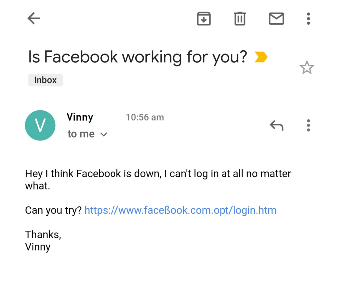
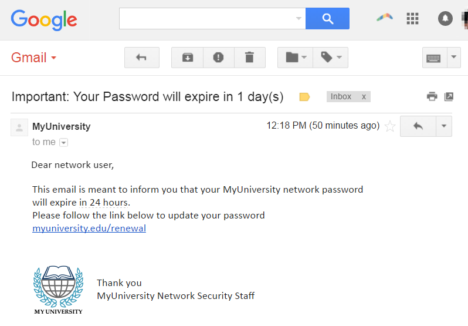
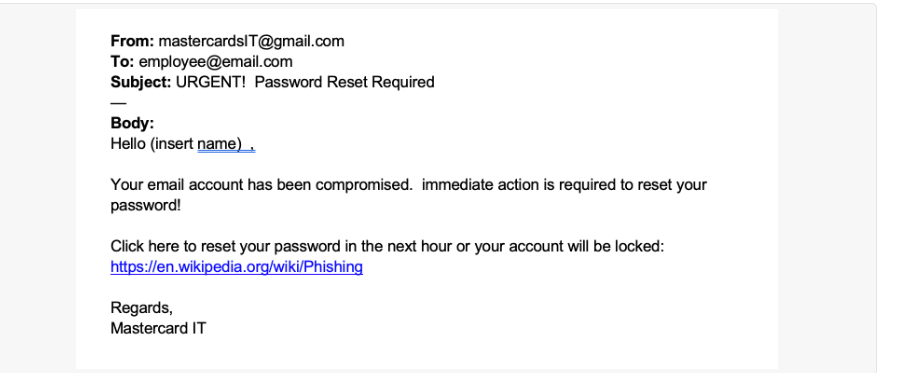
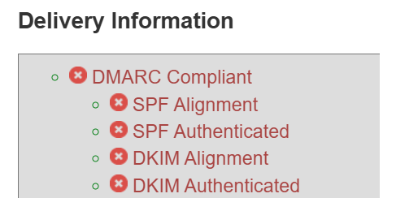

# 📄 Phishing Email Analysis

This document contains an analysis of multiple phishing email samples. Each sample is supported with a screenshot and a short explanation identifying phishing indicators.

---

## 1️⃣ Sample 1 – Facebook Scam Email

**Phishing Indicators:**
- Misleading display link: the domain appears to be "facebook" but is actually `faceßook.com.opt`, which is suspicious.
- Uses a Unicode character (`ß`) to trick the user into thinking it's legitimate.
- Attempts social engineering by asking the user to help, creating urgency and trust.

---

## 2️⃣ Sample 2 – University Password Expiry Notice

**Phishing Indicators:**
- Uses urgency: "Your password will expire in 1 day(s)" to create panic.
- Generic greeting: “Dear network user” instead of using the recipient's name.
- Hyperlink might redirect to a malicious site even though it appears to be a university URL.
- No personalization or proper contact verification.

---

## 3️⃣ Sample 3 – Fake Mastercard Reset Email

**Phishing Indicators:**
- Sender uses a free email domain (`@gmail.com`) for an official-looking message.
- Generic placeholder: “Hello (insert name)” shows it's mass-mailed and unprofessional.
- Threatens account lockout within 1 hour, which is classic phishing pressure tactic.
- URL provided is unrelated (`wikipedia.org`) – this could be an evasion trick or bait.

## 4️⃣ Email Header Analysis

The raw email header is saved in [`header.txt`](assets/header.txt) for reference.

### MXToolbox Header Analysis

**Findings:**
- SPF: Fail
- DKIM: Fail
- DMARC: Fail
  
